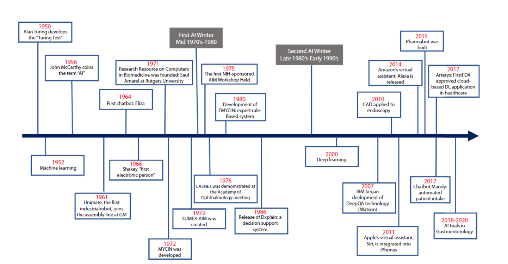

**AI and ML in Healthcare and Life sciences: How it all started**

To the curious friends of science,

The current spotlight of the entire world is on Artificial Intelligence (AI). From students, researchers, and even kids, use AI tools and bots. Would it be shocking if I told you that the idea of AI started somewhere around 1950s?

Yes, you read that right! It was in the 1950s, when **A. M. Turing** proposed a simple, crazy question **"Can machines think?"**

This question needed the definition of “machine” and “think.” A. M. Turing thought it would be absurd to define these terms. Thus, he came up with a closely related replaceable questions which would be expressed in relatively unambiguous words through – **The Imitation Game**. There are three players in this game a man (A), a woman (B), and an interrogator (C) who could be of any gender. The main goal of this game was to identify which is the man and which is the woman by asking A and B written questions by C. The role of A was to trick C into making wrong choices, whereas the role of B was to help C make the right decision. The communication happened through typewriting (teleprinter communication between two rooms).

Then Turing asked the following questions: "**What will happen when a machine takes the part of A in this game?**"- meaning replacing the man with a machine. “**Will the interrogator (C) decide wrongly as often when the game is played like this, as he does when the game is played between a man and a woman?”** These questions replaced the original question, **"Can machines think?"** If C is not able to differentiate between A and B with the presence of a machine in place of A, then the machine is said to “think.”

And that’s how it all started!

John McCarthy defined AI as "the science and engineering of making intelligent machines" six years later. Over the course of several decades, AI has developed from a basic set of "if, then rules" to increasingly intricate algorithms that function similarly to the human brain.

Developed in the early 1970s, **MYCIN** developed by Standford University as a doctoral dissertation of **Edward Shortliffe** was the first AI system in medicine to select antibiotics based on rules, demonstrating that computers might help physicians. It employed a basic inference engine to reason through scenarios and ran on a knowledge base of roughly **600 rules** that were encoded from expert knowledge. MYCIN's explainability was one of its outstanding features; physicians may inquire as to why it asked for particular data or how it arrived at a conclusion. MYCIN laid the groundwork for AI in medical decision assistance. MYCIN was never really put into use. It wasn't because of any performance issues rather due to moral and legal concerns about the use of computers in medicine.

Over the last fifty years, Artificial Intelligence in Medicine (AIM) has undergone significant changes. Applications of AIM have grown since the introduction of Machine Learning (ML) and Deep Learning (DL), opening the door to personalized medicine as opposed to algorithm-only-based medicine. In the future, predictive models may be applied to preventative medicine as well as disease diagnosis and therapeutic response prediction.

The below figure shows the timeline of the development and use of artificial intelligence in medicine.

**Figure 1 :** Timeline of the development and use AI in medicine

The current spotlight is because of the tremendous computational power, easy access, and digitalization. From the first Turing test to its current state, artificial intelligence has advanced significantly. However, further research and validation will be required for AI algorithms and their applications. More clinical evidence will be required to prove its effectiveness, worth, and influence on patient care and results.

References:

1.  Turing, A. M. (1950). COMPUTING MACHINERY AND INTELLIGENCE. In *Computing Machinery and Intelligence. Mind* (Vol. 49).
2.  Kaul, V., Enslin, S., & Gross, S. A. (2020). History of artificial intelligence in medicine. In *Gastrointestinal Endoscopy* (Vol. 92, Issue 4, pp. 807–812). Mosby Inc. https://doi.org/10.1016/j.gie.2020.06.040
3.  <https://en.wikipedia.org/wiki/Mycin>
